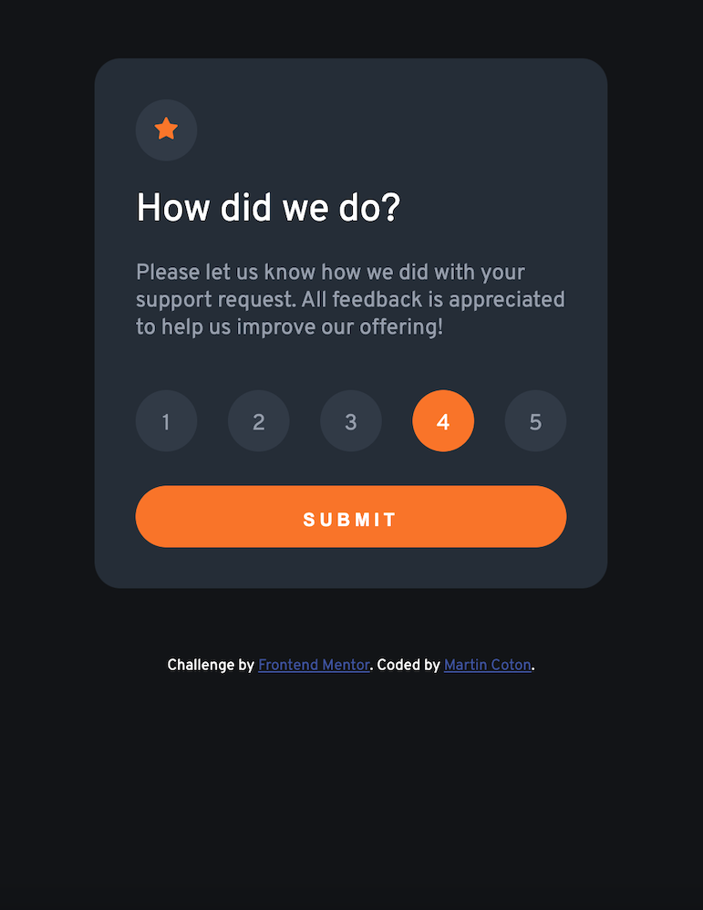
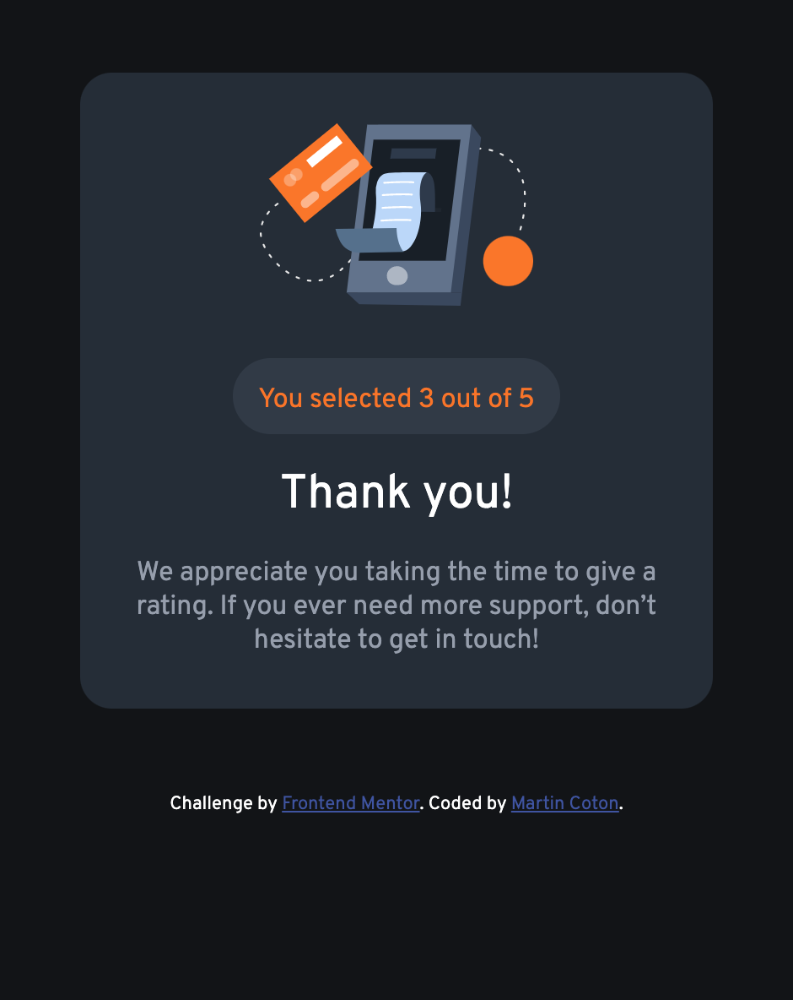

# Frontend Mentor - Interactive rating component solution

This is a solution to the [Interactive rating component challenge on Frontend Mentor](https://www.frontendmentor.io/challenges/interactive-rating-component-koxpeBUmI). Frontend Mentor challenges help you improve your coding skills by building realistic projects. 

## Table of contents

- [Overview](#overview)
  - [The challenge](#the-challenge)
  - [Screenshot](#screenshot)
  - [Links](#links)
- [My process](#my-process)
  - [Built with](#built-with)
  - [What I learned](#what-i-learned)
  - [Continued development](#continued-development)
  - [Useful resources](#useful-resources)
- [Author](#author)

## Overview

### The challenge

Users should be able to:

- View the optimal layout for the app depending on their device's screen size
- See hover states for all interactive elements on the page
- Select and submit a number rating
- See the "Thank you" card state after submitting a rating

### Screenshot

### Links

- Solution URL: [Repo on GitHub](https://github.com/MCoton/interactive-rating-component-main)
- Live Site URL: [Interactive rating component](https://mcoton.github.io/interactive-rating-component-main/)

## My process

Based on the supplied files and screen shots, broke down the component into sections based on the content.
Created a "main" element that could be styled as the component background, then wrapped the two "states" in seperate divs and changed the display attribute of the "thankyou" div to "hidden" with a css style. Planning to use that to show or hide each state div as needed.
From there broke the states down in their parts, inserted the images, formatted text - including utilising an unordered list to represent the rating choices, with the "li" display attribute set to "inline-block".
With the page layout more or less done, started work on the "active states" states as detailed in the style guide. Stuck to using only CSS for these.
Next was the actual interactivety using JavaScript. 

### Built with

- Semantic HTML5 markup
- CSS custom properties
- Flexbox
- JavaScript
- Mobile-first workflow

### What I learned

My knowledge of JS has become exceptionally rusty through lack of use. I leant heavily in the MDN documentation.

### Continued development

Based on this project, JavaScript needs a refresher.

### Useful resources

- [Understanding why my JS wasn't working](https://bobbyhadz.com/blog/javascript-addeventlistener-is-not-a-function)

## Author

- Frontend Mentor - [@MCoton](https://www.frontendmentor.io/profile/MCoton)
- Twitter - [@Martin_Coton](https://www.twitter.com/Martin_Coton)
